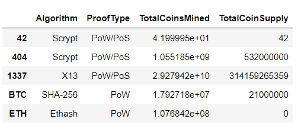
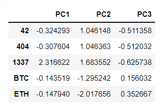
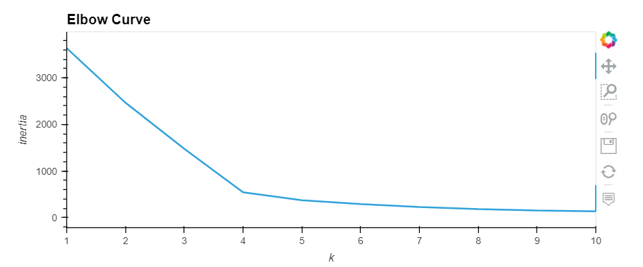
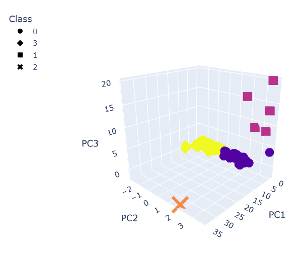
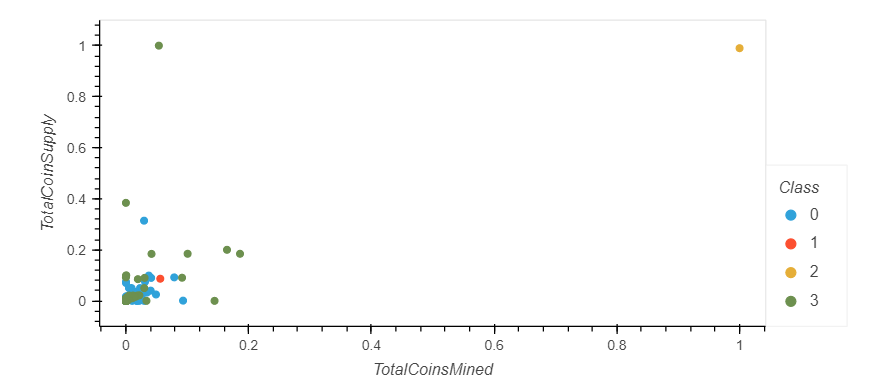

# Cryptocurrencies

# Purpose
To Create an analysis using unsupervised machine learning to process data, cluster, reduce dimensions, and reduce the principal components using PCA for Martha, our client at Accountability Accounting. We are to create a report on cryptocurrencies that are currently on the trading market for their new investment.

# Results
The Following steps were taken to accomplish our goal:
- preprocessed in the form of encoding and scaling with our desired columns for our althorithm

- utilzed the principal components analysis to reduce the dimension to better observe our cluster

- generated an elbow curve to find the best value of k to produce our scatter plots.

